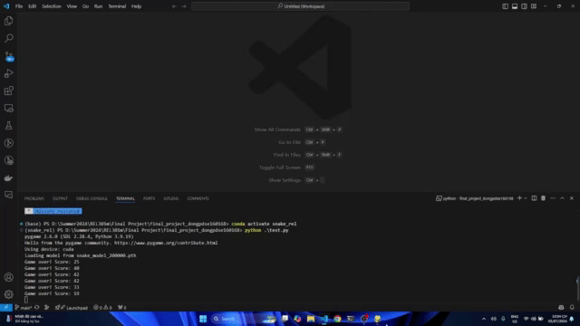

# Snake game AI

## Table of contents
* [Demo](#demo)
* [Technologies and Tools](#technologies-and-tools)
* [Setup](#setup)
* [Train](#train)
* [Test](#test)

## Demo

## Technologies and Tools
* Python 
* Pytorch
* Pygame

## Setup

* Use comand promt to setup environment.

`conda create -n snake_env python=3.9`

`conda activate snake_env`
 
`python -m pip r requirements.txt`

## Train

`python train.py`

## Test

`python test.py`
